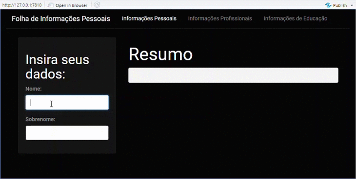

## Sumário

- [Introdução: Pacotes em R e o Shiny](#Introdução-Pacotes-em-R-e-o-Shiny)

  - [O que é um pacote em R?](#O-que-é-um-pacote-em-R)
    - [Lista de pacotes](#Lista-de-pacotes)
  - [O que é o Shiny?](#O-que-é-o-Shiny)
    - [Entradas e saídas do Shiny](#Entradas-e-saídas-do-Shiny)

  - [O que é uma aplicação web?](#O-que-é-uma-aplicação-web)

- [Construção da primeira aplicação web com Shiny](#Construção-da-primeira-aplicação-Web-com-Shiny)

  - [Primeiro passo: Como instalar o pacote](#Primeiro-passo-Como-instalar-o-pacote)
  - [Segundo passo: Construindo a aplicação](#Segundo-passo-Construindo-a-aplicação)
    - [Partes que compõem a aplicação](#Partes-que-compõem-a-aplicação)
    - [Código completo](#Código-completo)
    - [Demonstração da aplicação](#Demonstração-da-aplicação)

- [Outros materiais interessantes sobre o Shiny](#Outros-materiais-interessantes-sobre-o-Shiny)


## Introdução: Pacotes em R e o Shiny

### O que é um pacote em R?

Pacotes (em inglês _packages_) em R são bibliotecas contendo funções e dados importantes para alguma finalidade específica. 

Por exemplo, o pacote USCensus2010 contém essencialmente vários dados sobre o Censo dos Estados Unidos de 2010, com algumas funções auxiliares para tratar estes dados.

#### Lista de pacotes

A lista de pacotes encontra-se disponível no site CRAN (Comprehensive R Archive Network), localizado em <http://cran.r-project.org/> e em seus mirrors. Cada pacote é identificado por um nome, uma string alfanumérica, iniciada por uma letra e case-sensitive; por exemplo bigRR, HotDeckInputation ou R2jags.

### O que é shiny?

O Shiny se trata de um sistema para desenvolvimento de **aplicações web** usando o R, um pacote do R (shiny) e um servidor web (shiny server). Temos uma breve explicação abaixo sobre [o que é uma aplicação web](#o-que-é-uma-aplicação-web).

> Observação: Não confundir o shiny com uma página web!

#### Entradas e saídas no shiny

##### inputPanel

É preciso adicionar os inputs para criar o painel onde os usuários possam interagir. 

Na prática, inputs são widgets que possibilitam a interação do usuário com o app. Eles recebem um valor escolhido pelo usuário e o envia para o server side.

Segue uma lista das principais funções para inputs utilizados em um Shiny app:

- ``actionButton``: botão para executar uma ação.

- ``checkboxGroupInput``: um grupo de check boxes.

- ``checkboxInput``: um único check box.

- ``fileInput``: uma ferramenta para auxiliar o upload de arquivos.

- ``numericInput``: Um campo para enviar números.

- ``radioButtons``: Um conjunto de botões para seleção.

- ``selectInput``: Um select box com um conjunto de opções.

- ``textInput``: Um campo para enviar texto.

##### renders

Os outputs devem ser construídos com funções render_(). Existe uma função render_() para cada tipo de objeto.O argumento dessas funções será sempre um bloco de código, usado para gerar o output desejado.

Segue uma lista das principais funções para outputs utilizados em um Shiny app:

- ``renderDataTable``: data frames.

- ``renderImage``: imagens.

- ``renderPlot``: gráficos.

- ``renderPrint``: qualquer printed output.

- ``renderTable``: data frames, matrizes, e outras estruturas em forma de tabela.

- ``renderText``: strings.

- ``renderUI``: um elemento do UI ou HTML.


### O que é uma aplicação Web?

Aplicações Web se referem a **sistemas de informação** construídos com base em **tecnologias** e **protocolos** próprios da **Web**, tais como HTTP, HTTPS, HTML, CSS e Javascript. Estas aplicações podem ainda utilizar frameworks e bibliotecas derivados das tecnologias já citadas, a exemplo da biblioteca React, destina à construção de interfaces para **sites** renderizados em browsers de PC, React Native, destinada ao desenvolvimento de **aplicativos móveis** ***crossplatforms***, e Node.Js, destinada à criação de sistemas que rodam em servidores. Não necessariamente estas aplicações precisam estar conectadas à rede para funcionarem.

De forma geral, no mercado da tecnologia da informação, o desenvolvimento deste tipo de sistema, é dividido em: desenvolvimento **front-end**, que se refere à porcão ***client-side***, e em **back-end**, que se refere ao ***server-side***. Ambas as ramificações configuram aplicações web, tanto quando consideradas sob uma ótica individual, quanto conjunta. Neste último caso, a arquitetura do sistema revela a lógica ou o padrão mais comum de funcionamento das aplicações Web: o **modelo de requisições** (enviadas pelo usuário) **e de respostas** (enviadas pelos servidores). 

Todos os serviços de streaming de música ou filmes, internet banking e redes sociais, frequentemente usados por nós, constituem complexas aplicações Web, que utilizam não apenas uma, mas várias tecnologias Web.

Neste contexto, o **Shiny** é um sistema composto por: um **pacote de funções** construídas na Linguagem R e um **servidor web** denominado ***"Shiny server"***, este conjunto permite a criação de **interfaces** amigáveis para a **visualização** e a **análise de dados** em aplicações Web. Este pacote permite a interação do usuário com os dados da maneira que mais lhe for conveniente, o que pode envolver desde a criação de filtros à escolha do tipo de visualização (gráficos de dispersão, histogramas etc.). Isto é possível gracas à sua integração com outros pacotes R como ggvis, ggiraph, plotly, etc.

É importante pontuar que **o Shiny não é uma aplicação web**, mas sim uma extensão que torna a Linguagem R uma tecnologia ainda mais robusta e versátil!


## Construção da primeira aplicação Web com Shiny

### Primeiro passo: Instalar o pacote

Digite  `install.packages("shiny")`no console do RStudio.

Pronto, o Shiny já está no projeto!

> Dica: para tornar sua aplicação mais bonita com temas já prontos, baixe também o pacote *shinythemes*! A forma de instalação é a mesma do Shiny.

### Segundo passo: Construir a aplicação

#### Partes que compõem a aplicação

As linhas de código da aplicação serão divididas em quatro partes muito importantes: 

1. **Carregamento de pacotes**:

   Fica no início. É aqui onde serão especificados todos os pacotes usados na aplicação.

2. ***UI (user interface)* ou *client side***:

   Onde será configurado tudo o que o cliente verá, como barra de navegação, campos em branco para preenchimento de informações, cores, etc.

3. ***Server Side***:

   Configurar o visual da aplicação não é o suficiente se esta aplicação sabe que respostas dar de acordo com as informações que recebeu. É no *server side* que esse tipo de especificação é definida.

4. **Criação do Objeto (sua aplicação):**

   Parte final. Onde o Shiny vai juntar tudo o que foi escrito para criar a aplicação.


#### Código completo

```R
# 1. Carregamento de Pacotes:
library(shiny)
library(shinythemes)


# 2. UI (user interface) ou client side:
ui <- fluidPage(theme = shinytheme("cyborg"),
  navbarPage(

    "Folha de Informações Pessoais",
    tabPanel("Informações Pessoais",
      sidebarPanel(
        tags$h3("Insira seus dados:"),
        textInput("txt1", "Nome:", ""),
        textInput("txt2", "Sobrenome:", ""),
      ),

      mainPanel(
        h2("Resumo"),
        verbatimTextOutput("txtout"),
      )

    ),
    tabPanel("Informações Profissionais", "A preencher"),
    tabPanel("Informações de Educação", "A preencher")
  )
)


# 3. Server Side
server <- function(input, output) {

  output$txtout <- renderText({
    paste( input$txt1, input$txt2, sep = " " )
  })
}


# 4. Criação do Objeto (sua aplicação)
shinyApp(ui = ui, server = server)
```

#### Demonstração da aplicação



### Outros materiais interessantes sobre o shiny

<https://shiny.rstudio.com/tutorial/>

<https://shiny.rstudio.com/tutorial/written-tutorial/lesson1/>

<http://material.curso-r.com/shiny/>

<https://github.com/rstudio/shiny-examples>