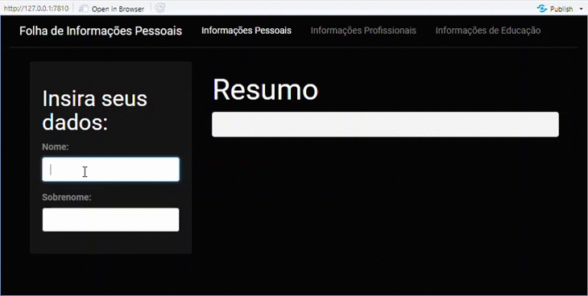

Linguagem R - Pacote Shiny
================
Mariana Vieira, Izavan Correia, Daniel S
03/03/2021


## Sumário

-   [Sobre o pacote Shiny](#Sobre-o-pacote-Shiny)
-   [Mas o que é uma aplicação Web?](#Mas-o-que-é-uma-aplicação-Web?)
-   [Construção da primeira aplicação Web com
    Shiny](#Construção-da-primeira-aplicação-Web-com-Shiny)
    -   [Primeiro passo: Instalar o
        pacote](#Primeiro-passo:-Instalar-o-pacote)
    -   [Segundo passo: Construir a
        aplicação](#Segundo-passo:-Construir-a-aplicação)
        -   [Partes que compõem a
            aplicação](#Partes-que-compõem-a-aplicação)
        -   [Código completo](#Código-completo)
        -   [Demonstração da aplicação](#Demonstração-da-aplicação)

## Sobre o pacote Shiny

## Mas o que é uma aplicação Web?


## Construção da primeira aplicação Web com Shiny

### Primeiro passo: Instalar o pacote

Digite `install.packages("shiny")`no console do RStudio.

Pronto, o Shiny já está no projeto!

> Dica: para tornar sua aplicação mais bonita com temas já prontos,
> baixe também o pacote *shinythemes*! A forma de instalação é a mesma
> do Shiny.

### Segundo passo: Construir a aplicação

#### Partes que compõem a aplicação

As linhas de código da aplicação serão divididas em quatro partes muito
importantes:

1.  **Carregamento de pacotes**:

    Fica no início. É aqui onde serão especificados todos os pacotes
    usados na aplicação.

2.  ***UI (user interface)* ou *client side***:

    Onde será configurado tudo o que o cliente verá, como barra de
    navegação, campos em branco para preenchimento de informações,
    cores, etc.

3.  ***Server Side***:

    Configurar o visual da aplicação não é o suficiente se esta
    aplicação sabe que respostas dar de acordo com as informações que
    recebeu. É no *server side* que esse tipo de especificação é
    definida.

4.  **Criação do Objeto (sua aplicação):**

    Parte final. Onde o Shiny vai juntar tudo o que foi escrito para
    criar a aplicação.


#### Código completo

``` r
# 1. Carregamento de Pacotes:
library(shiny)
library(shinythemes)


# 2. UI (user interface) ou client side:
ui <- fluidPage(theme = shinytheme("cyborg"),
  navbarPage(

    "Folha de Informações Pessoais",
    tabPanel("Informações Pessoais",
      sidebarPanel(
        tags$h3("Insira seus dados:"),
        textInput("txt1", "Nome:", ""),
        textInput("txt2", "Sobrenome:", ""),
      ),

      mainPanel(
        h2("Resumo"),
        verbatimTextOutput("txtout"),
      )

    ),
    tabPanel("Informações Profissionais", "A preencher"),
    tabPanel("Informações de Educação", "A preencher")
  )
)


# 3. Server Side
server <- function(input, output) {

  output$txtout <- renderText({
    paste( input$txt1, input$txt2, sep = " " )
  })
}


# 4. Criação do Objeto (sua aplicação)
shinyApp(ui = ui, server = server)
```

#### Demonstração da aplicação


